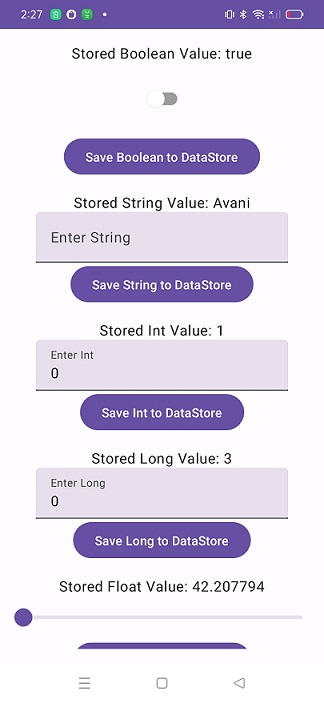

# Manage DataStore Preferences

A simple app built in Jetpack Compose from scratch to demonstrate the implementation of DataStore Preferences with all data types(Boolean, Int, Long, Float, String, Double). Also shows a UI where inputs can be taken through Textfields, Switch and Slider.

## Features

- Custom UI with Textfields, Switch and Slider components to take input from UI and store values in DataStore Preferences

## Screenshot



## Getting Started

1. Clone the repository ```git clone https://github.com/avanisoam/BusinessCardApp.git```
2. Open the project in Android Studio
3. Build and run the app on an emulator or a device

## Built With

- [Kotlin](https://kotlinlang.org/) - Programming language
- [Jetpack Compose](https://developer.android.com/jetpack/compose) - UI toolkit

## Authors

- **Avani Soam** - [avanisoam](https://github.com/avanisoam)

## License

This project is licensed under the MIT License - see the [LICENSE.md](LICENSE.md) file for details

## Article On Medium

- Read on [Medium](https://medium.com/@avanisoam/managing-datastore-preferences-in-jetpack-compose-a-comprehensive-guide-ecd29f5a9930)
